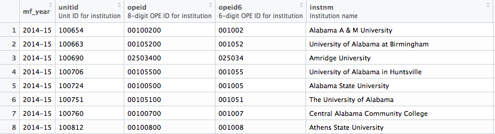

<!-- README.md is generated from README.Rmd. Please edit that file -->

```{r, echo = FALSE}
knitr::opts_chunk$set(
  collapse = TRUE,
  comment = "#>",
  fig.path = "README-files/",
  cache = TRUE,
  message = FALSE,
  warning = FALSE,
  fig.height = 10
)
```

# About `scorecard`

[](https://travis-ci.org/jjchern/scorecard)
[](https://ci.appveyor.com/project/jjchern/scorecard)

The `scorecard` package includes processed datasets from the [College Scorecard](https://collegescorecard.ed.gov), 1996-2015.

The Scorecard datasets are imbalance panels at the colleges-by-school-year level. The data was last updated in 2017. See the [changelog](https://collegescorecard.ed.gov/data/changelog/) for more details.

The following datasets are available:

- `scorecard::mf1996_97`
- `scorecard::mf1997_98`
- `scorecard::mf1998_99`
- `scorecard::mf1999_00`
- `scorecard::mf2000_01`
- `scorecard::mf2001_02`
- `scorecard::mf2002_03`
- `scorecard::mf2003_04`
- `scorecard::mf2004_05`
- `scorecard::mf2005_06`
- `scorecard::mf2006_07`
- `scorecard::mf2007_08`
- `scorecard::mf2008_09`
- `scorecard::mf2009_10`
- `scorecard::mf2010_11`
- `scorecard::mf2011_12`
- `scorecard::mf2012_13`
- `scorecard::mf2013_14`
- `scorecard::mf2014_15`
- `scorecard::mf2015_16`
- `scorecard::mf2016_17`
- `scorecard::mf2017_18`
- `scorecard::codebook`
- `scorecard::cohort_map`

The following functions are implemented:

- `scorecard::attach_var_label()`: Assign variable labels.
- `scorecard::attach_val_label()`: Assign value labels for certain variables

# Related R Package

[Benjamin Skinner](https://github.com/btskinner) has created a wonderful R client [`rscorecard`](http://btskinner.me/rscorecard/) for the [College Scorecard GET API](https://collegescorecard.ed.gov/data/documentation/). If you're interested in 
getting some specific variables quickly, I suggest using the `rscorecard` package.

# Installation

You can also download the datasets as an R package. It might take a while to install and load into memory. To download the most recent stable release, use

```R
# install.packages("devtools")
devtools::install_github("jjchern/scorecard@v0.3.0")

# To uninstall the package, use:
# remove.packages("scorecard")
```

# Examples

## Loading the merged file for school year 2014-15

All datasets are tibbles:

```{r}
library(tidyverse)
scorecard::mf2014_15
```

## Working with variable and value labels

All the datasets have variable labels attached, which can be viewed in RStudio's Data Viewer:

```R
View(scorecard::mf2014_15)
```



You can also use the `labelled` package:

```{r}
scorecard::mf2014_15 %>% 
  select(1:8) %>% 
  labelled::var_label()
```

Or work with the codebook directly:

```{r}
## Show variable labels
scorecard::codebook %>% 
  select(var_name, var_label)

## Build a small function to shown value labels
show_val_label = . %>% {
    filter(scorecard::codebook, var_name == .) %>% 
    mutate(val_label = glue::glue("{val_label}  = {value}")) %>% 
    distinct(val_label)}

## Show value labels:
show_val_label("curroper")
show_val_label("distanceonly")
```

<!-- In binding multiple years of data with `dyplr::bind_rows()`, however, labels will get dropped. To throw back the labels, `scorecard` also provides to simple functions that attach variable and value labels to the tibbles: -->

<!-- ```{r} -->
<!-- bind_rows( -->
<!--   scorecard::mf2014_15 %>% select(mf_year, instnm, control, adm_rate), -->
<!--   scorecard::mf2013_14 %>% select(mf_year, instnm, control, adm_rate) -->
<!-- ) %>%  -->
<!--   scorecard::attach_var_label() %>%  -->
<!--   scorecard::attach_val_label() -> df -->

<!-- df -->
<!-- labelled::var_label(df) -->
<!-- labelled::val_labels(df) -->
<!-- ``` -->

## Exploring codebook and plot in-state tuition with a joyplot

```{r in_tuition}
vars = c("mf_year", "iclevel", "control", "tuitionfee_in")

scorecard::codebook %>% 
  select(var_name, var_label, value, val_label) %>% 
  filter(var_name %in% vars) %>% 
  knitr::kable()

dplyr_seq = . %>% 
  select(one_of(vars)) %>%
  haven::as_factor() %>% 
  filter(iclevel %in% c("4-year", "2-year")) %>% 
  mutate(year = mf_year %>% parse_number() %>% as.factor()) %>% 
  group_by(iclevel, control) %>% 
  mutate_at(c("tuitionfee_in"),
            ~statar::winsorise(., probs = c(0.02, 0.98), verbose = FALSE)) %>% 
  ungroup()

## Test the functional sequence
scorecard::mf2014_15 %>% dplyr_seq()

bind_rows(
  scorecard::mf2017_18 %>% dplyr_seq(),
  scorecard::mf2016_17 %>% dplyr_seq(),
  scorecard::mf2015_16 %>% dplyr_seq(),
  scorecard::mf2014_15 %>% dplyr_seq(),
  scorecard::mf2013_14 %>% dplyr_seq(),
  scorecard::mf2012_13 %>% dplyr_seq(),
  scorecard::mf2011_12 %>% dplyr_seq(),
  scorecard::mf2010_11 %>% dplyr_seq(),
  scorecard::mf2009_10 %>% dplyr_seq(),
  scorecard::mf2008_09 %>% dplyr_seq(),
  scorecard::mf2007_08 %>% dplyr_seq(),
  scorecard::mf2006_07 %>% dplyr_seq(),
  scorecard::mf2005_06 %>% dplyr_seq(),
  scorecard::mf2004_05 %>% dplyr_seq(),
  scorecard::mf2003_04 %>% dplyr_seq(),
  scorecard::mf2002_03 %>% dplyr_seq(),
  scorecard::mf2001_02 %>% dplyr_seq(),
  scorecard::mf2000_01 %>% dplyr_seq()
) -> df

df %>% 
  ggplot(aes(x = tuitionfee_in, y = year, fill = iclevel)) +
  ggjoy::geom_joy(scale = 2, alpha = .8, colour = "white") +
  ggjoy::theme_joy() +
  facet_grid(iclevel~control, scales = "free") +
  labs(x = NULL, y = NULL,
       title = "In-State Tuition and Fees, 2000-2017") +
  scale_x_continuous(labels = scales::dollar) +
  scale_y_discrete(breaks = seq(2017, 2000, -3), 
                   expand = c(0.01, 0)) +
  theme(axis.text = element_text(size = 8),
        legend.position = "none")
```

## Compareing in-state and out-of-state tuition and fees

```{r in_or_out_tuition}
vars = c("mf_year", "iclevel", "control", "tuitionfee_in", "tuitionfee_out")

dplyr_seq = . %>% 
  select(one_of(vars)) %>%
  haven::as_factor() %>% 
  filter(iclevel %in% c("4-year", "2-year")) %>% 
  filter(control == "Public") %>% 
  mutate(type = paste(control, iclevel)) %>% 
  mutate(year = mf_year %>% parse_number() %>% as.factor()) %>% 
  group_by(type) %>% 
  mutate_at(c("tuitionfee_in", "tuitionfee_out"),
            ~statar::winsorise(., probs = c(0.02, 0.98), verbose = FALSE)) %>% 
  ungroup() %>% 
  gather(in_or_out, tuitionfee, tuitionfee_in:tuitionfee_out) %>% 
  mutate(in_or_out = if_else(in_or_out == "tuitionfee_in",
                              "In-state tuition and fees",
                              "Out-of-state tuition and fees"))

## Test the functional sequence
scorecard::mf2014_15 %>% dplyr_seq()

bind_rows(
  scorecard::mf2017_18 %>% dplyr_seq(),
  scorecard::mf2016_17 %>% dplyr_seq(),
  scorecard::mf2015_16 %>% dplyr_seq(),
  scorecard::mf2014_15 %>% dplyr_seq(),
  scorecard::mf2013_14 %>% dplyr_seq(),
  scorecard::mf2012_13 %>% dplyr_seq(),
  scorecard::mf2011_12 %>% dplyr_seq(),
  scorecard::mf2010_11 %>% dplyr_seq(),
  scorecard::mf2009_10 %>% dplyr_seq(),
  scorecard::mf2008_09 %>% dplyr_seq(),
  scorecard::mf2007_08 %>% dplyr_seq(),
  scorecard::mf2006_07 %>% dplyr_seq(),
  scorecard::mf2005_06 %>% dplyr_seq(),
  scorecard::mf2004_05 %>% dplyr_seq(),
  scorecard::mf2003_04 %>% dplyr_seq(),
  scorecard::mf2002_03 %>% dplyr_seq(),
  scorecard::mf2001_02 %>% dplyr_seq(),
  scorecard::mf2000_01 %>% dplyr_seq()
) -> df

df %>% 
  ggplot(aes(x = tuitionfee, y = year, fill = in_or_out)) +
  ggjoy::geom_joy(scale = 2, alpha = .8, colour = "white") +
  ggjoy::theme_joy() +
  facet_wrap(~type, scales = "free") +
  labs(x = NULL, y = NULL,
       title = "In-State Vs. Out-of-State Tuition and Fees for Public Colleges",
       caption = "Source: College Scorecard, 2000-2017") +
  scale_x_continuous(labels = scales::dollar) +
  scale_y_discrete(breaks = seq(2017, 2000, -3), 
                   expand = c(0.01, 0)) +
  theme(axis.text = element_text(size = 9),
        legend.position = "top",
        legend.title = element_blank(),
        legend.justification = "center")
```
