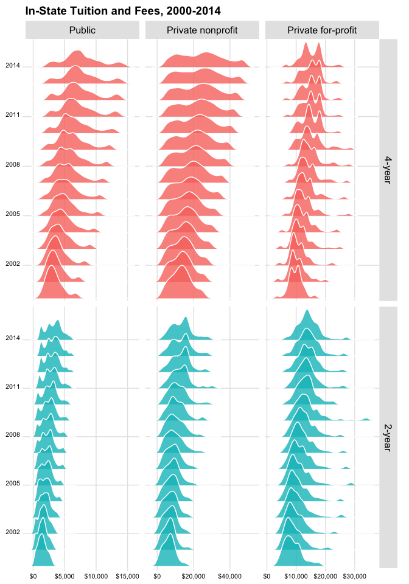
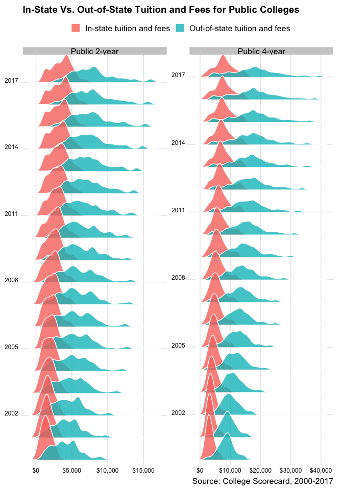
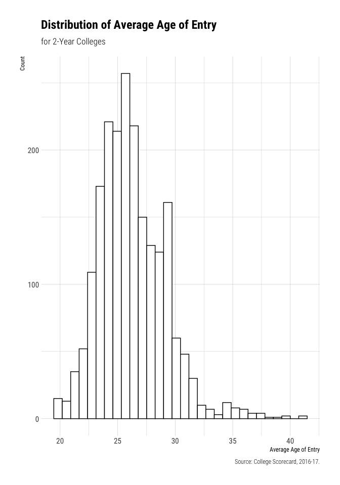
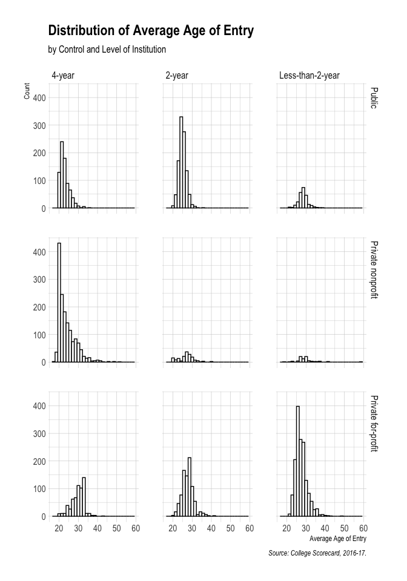

<!-- README.md is generated from README.Rmd. Please edit that file -->

# About `scorecard`

[](https://travis-ci.org/jjchern/scorecard)
[](https://ci.appveyor.com/project/jjchern/scorecard)

The `scorecard` package includes processed datasets from the [College
Scorecard](https://collegescorecard.ed.gov), 1996-2017.

The Scorecard datasets are imbalance panels at the
colleges-by-school-year level. The data was last updated in 2019. See
the [changelog](https://collegescorecard.ed.gov/data/changelog/) for
more details.

The following datasets are available:

  - `scorecard::mf1996_97`
  - `scorecard::mf1997_98`
  - `scorecard::mf1998_99`
  - `scorecard::mf1999_00`
  - `scorecard::mf2000_01`
  - `scorecard::mf2001_02`
  - `scorecard::mf2002_03`
  - `scorecard::mf2003_04`
  - `scorecard::mf2004_05`
  - `scorecard::mf2005_06`
  - `scorecard::mf2006_07`
  - `scorecard::mf2007_08`
  - `scorecard::mf2008_09`
  - `scorecard::mf2009_10`
  - `scorecard::mf2010_11`
  - `scorecard::mf2011_12`
  - `scorecard::mf2012_13`
  - `scorecard::mf2013_14`
  - `scorecard::mf2014_15`
  - `scorecard::mf2015_16`
  - `scorecard::mf2016_17`
  - `scorecard::mf2017_18`
  - `scorecard::codebook`
  - `scorecard::cohort_map`

The following functions are implemented:

  - `scorecard::attach_var_label()`: Assign variable labels.
  - `scorecard::attach_val_label()`: Assign value labels for certain
    variables

# Related R Package

[Benjamin Skinner](https://github.com/btskinner) has created a wonderful
R client [`rscorecard`](http://btskinner.me/rscorecard/) for the
[College Scorecard GET
API](https://collegescorecard.ed.gov/data/documentation/). If you’re
interested in getting some specific variables quickly, I suggest using
the `rscorecard` package.

# Installation

You can also download the datasets as an R package. It might take a
while to install and load into memory. To download the most recent
stable release, use

``` r
# install.packages("devtools")
devtools::install_github("jjchern/scorecard@v0.4.0")

# To uninstall the package, use:
# remove.packages("scorecard")
```

# Examples

## Loading the merged file for school year 2014-15

All datasets are tibbles:

``` r
library(tidyverse)
scorecard::mf2014_15
#> # A tibble: 7,703 x 1,660
#>    mf_year unitid opeid opeid6 instnm city  stabbr zip   sch_deg    main
#>    <chr>   <chr>  <chr> <chr>  <chr>  <chr> <chr>  <chr>   <dbl> <dbl+l>
#>  1 2014-15 100654 0010… 001002 Alaba… Norm… AL     35762       3 1 [Mai…
#>  2 2014-15 100663 0010… 001052 Unive… Birm… AL     3529…       3 1 [Mai…
#>  3 2014-15 100690 0250… 025034 Amrid… Mont… AL     3611…       3 1 [Mai…
#>  4 2014-15 100706 0010… 001055 Unive… Hunt… AL     35899       3 1 [Mai…
#>  5 2014-15 100724 0010… 001005 Alaba… Mont… AL     3610…       3 1 [Mai…
#>  6 2014-15 100751 0010… 001051 The U… Tusc… AL     3548…       3 1 [Mai…
#>  7 2014-15 100760 0010… 001007 Centr… Alex… AL     35010       2 1 [Mai…
#>  8 2014-15 100812 0010… 001008 Athen… Athe… AL     35611       3 1 [Mai…
#>  9 2014-15 100830 0083… 008310 Aubur… Mont… AL     3611…       3 1 [Mai…
#> 10 2014-15 100858 0010… 001009 Aubur… Aubu… AL     36849       3 1 [Mai…
#> # … with 7,693 more rows, and 1,650 more variables: numbranch <dbl>,
#> #   preddeg <dbl+lbl>, highdeg <dbl+lbl>, control <dbl+lbl>,
#> #   st_fips <dbl+lbl>, region <dbl+lbl>, adm_rate <dbl>,
#> #   adm_rate_all <dbl>, satvr25 <dbl>, satvr75 <dbl>, satmt25 <dbl>,
#> #   satmt75 <dbl>, satwr25 <dbl>, satwr75 <dbl>, satvrmid <dbl>,
#> #   satmtmid <dbl>, satwrmid <dbl>, actcm25 <dbl>, actcm75 <dbl>,
#> #   acten25 <dbl>, acten75 <dbl>, actmt25 <dbl>, actmt75 <dbl>,
#> #   actwr25 <dbl>, actwr75 <dbl>, actcmmid <dbl>, actenmid <dbl>,
#> #   actmtmid <dbl>, actwrmid <dbl>, sat_avg <dbl>, sat_avg_all <dbl>,
#> #   pcip01 <dbl>, pcip03 <dbl>, pcip04 <dbl>, pcip05 <dbl>, pcip09 <dbl>,
#> #   pcip10 <dbl>, pcip11 <dbl>, pcip12 <dbl>, pcip13 <dbl>, pcip14 <dbl>,
#> #   pcip15 <dbl>, pcip16 <dbl>, pcip19 <dbl>, pcip22 <dbl>, pcip23 <dbl>,
#> #   pcip24 <dbl>, pcip25 <dbl>, pcip26 <dbl>, pcip27 <dbl>, pcip29 <dbl>,
#> #   pcip30 <dbl>, pcip31 <dbl>, pcip38 <dbl>, pcip39 <dbl>, pcip40 <dbl>,
#> #   pcip41 <dbl>, pcip42 <dbl>, pcip43 <dbl>, pcip44 <dbl>, pcip45 <dbl>,
#> #   pcip46 <dbl>, pcip47 <dbl>, pcip48 <dbl>, pcip49 <dbl>, pcip50 <dbl>,
#> #   pcip51 <dbl>, pcip52 <dbl>, pcip54 <dbl>, cip01cert1 <dbl+lbl>,
#> #   cip01cert2 <dbl+lbl>, cip01assoc <dbl+lbl>, cip01cert4 <dbl>,
#> #   cip01bachl <dbl>, cip03cert1 <dbl>, cip03cert2 <dbl>,
#> #   cip03assoc <dbl>, cip03cert4 <dbl>, cip03bachl <dbl>,
#> #   cip04cert1 <dbl>, cip04cert2 <dbl>, cip04assoc <dbl>,
#> #   cip04cert4 <dbl>, cip04bachl <dbl>, cip05cert1 <dbl>,
#> #   cip05cert2 <dbl>, cip05assoc <dbl>, cip05cert4 <dbl>,
#> #   cip05bachl <dbl>, cip09cert1 <dbl>, cip09cert2 <dbl>,
#> #   cip09assoc <dbl>, cip09cert4 <dbl>, cip09bachl <dbl>,
#> #   cip10cert1 <dbl>, cip10cert2 <dbl>, cip10assoc <dbl>,
#> #   cip10cert4 <dbl>, cip10bachl <dbl>, cip11cert1 <dbl>, …
```

## Working with variable and value labels

All the datasets have variable labels attached, which can be viewed in
RStudio’s Data Viewer:

``` r
View(scorecard::mf2014_15)
```


You can also use the `labelled` package:

``` r
scorecard::mf2014_15 %>% 
  select(1:8) %>% 
  labelled::var_label()
#> $mf_year
#> NULL
#> 
#> $unitid
#> [1] "Unit ID for institution"
#> 
#> $opeid
#> [1] "8-digit OPE ID for institution"
#> 
#> $opeid6
#> [1] "6-digit OPE ID for institution"
#> 
#> $instnm
#> [1] "Institution name"
#> 
#> $city
#> [1] "City"
#> 
#> $stabbr
#> [1] "State postcode"
#> 
#> $zip
#> [1] "ZIP code"
```

Or work with the codebook directly:

``` r
## Show variable labels
scorecard::codebook %>% 
  select(var_name, var_label)
#> # A tibble: 2,231 x 2
#>    var_name     var_label                                 
#>    <chr>        <chr>                                     
#>  1 unitid       Unit ID for institution                   
#>  2 opeid        8-digit OPE ID for institution            
#>  3 opeid6       6-digit OPE ID for institution            
#>  4 instnm       Institution name                          
#>  5 city         City                                      
#>  6 stabbr       State postcode                            
#>  7 zip          ZIP code                                  
#>  8 accredagency Accreditor for institution                
#>  9 insturl      URL for institution's homepage            
#> 10 npcurl       URL for institution's net price calculator
#> # … with 2,221 more rows

## Build a small function to shown value labels
show_val_label = . %>% {
    filter(scorecard::codebook, var_name == .) %>% 
    mutate(val_label = glue::glue("{val_label}  = {value}")) %>% 
    distinct(val_label)}

## Show value labels:
show_val_label("curroper")
#> # A tibble: 2 x 1
#>   val_label                                               
#>   <glue>                                                  
#> 1 Not currently certified as an operating institution  = 0
#> 2 Currently certified as operating  = 1
show_val_label("distanceonly")
#> # A tibble: 2 x 1
#>   val_label                       
#>   <glue>                          
#> 1 Not distance-education only  = 0
#> 2 Distance-education only  = 1
```

<!-- In binding multiple years of data with `dyplr::bind_rows()`, however, labels will get dropped. To throw back the labels, `scorecard` also provides to simple functions that attach variable and value labels to the tibbles: -->

<!-- ```{r} -->

<!-- bind_rows( -->

<!--   scorecard::mf2014_15 %>% select(mf_year, instnm, control, adm_rate), -->

<!--   scorecard::mf2013_14 %>% select(mf_year, instnm, control, adm_rate) -->

<!-- ) %>%  -->

<!--   scorecard::attach_var_label() %>%  -->

<!--   scorecard::attach_val_label() -> df -->

<!-- df -->

<!-- labelled::var_label(df) -->

<!-- labelled::val_labels(df) -->

<!-- ``` -->

## Exploring codebook and plot distributions of in-state tuition

``` r
vars = c("mf_year", "iclevel", "control", "tuitionfee_in")

scorecard::codebook %>% 
  select(var_name, var_label, value, val_label) %>% 
  filter(var_name %in% vars) %>% 
  knitr::kable()
```

| var\_name      | var\_label                | value | val\_label         |
| :------------- | :------------------------ | ----: | :----------------- |
| control        | Control of institution    |     1 | Public             |
| control        | Control of institution    |     2 | Private nonprofit  |
| control        | Control of institution    |     3 | Private for-profit |
| tuitionfee\_in | In-state tuition and fees |    NA | NA                 |
| iclevel        | Level of institution      |     1 | 4-year             |
| iclevel        | Level of institution      |     2 | 2-year             |
| iclevel        | Level of institution      |     3 | Less-than-2-year   |

``` r

dplyr_seq = . %>% 
  select(one_of(vars)) %>%
  haven::as_factor() %>% 
  filter(iclevel %in% c("4-year", "2-year")) %>% 
  mutate(year = mf_year %>% parse_number() %>% as.factor()) %>% 
  group_by(iclevel, control) %>% 
  mutate_at(c("tuitionfee_in"),
            ~statar::winsorise(., probs = c(0.02, 0.98), verbose = FALSE)) %>% 
  ungroup()

## Test the functional sequence
scorecard::mf2014_15 %>% dplyr_seq()
#> # A tibble: 5,530 x 5
#>    mf_year iclevel control           tuitionfee_in year 
#>    <chr>   <fct>   <fct>                     <dbl> <fct>
#>  1 2014-15 4-year  Public                     9096 2014 
#>  2 2014-15 4-year  Public                     7510 2014 
#>  3 2014-15 4-year  Private nonprofit          6900 2014 
#>  4 2014-15 4-year  Public                     9158 2014 
#>  5 2014-15 4-year  Public                     8720 2014 
#>  6 2014-15 4-year  Public                     9826 2014 
#>  7 2014-15 2-year  Public                     3491 2014 
#>  8 2014-15 4-year  Public                       NA 2014 
#>  9 2014-15 4-year  Public                     9080 2014 
#> 10 2014-15 4-year  Public                    10200 2014 
#> # … with 5,520 more rows

bind_rows(
  scorecard::mf2017_18 %>% dplyr_seq(),
  scorecard::mf2016_17 %>% dplyr_seq(),
  scorecard::mf2015_16 %>% dplyr_seq(),
  scorecard::mf2014_15 %>% dplyr_seq(),
  scorecard::mf2013_14 %>% dplyr_seq(),
  scorecard::mf2012_13 %>% dplyr_seq(),
  scorecard::mf2011_12 %>% dplyr_seq(),
  scorecard::mf2010_11 %>% dplyr_seq(),
  scorecard::mf2009_10 %>% dplyr_seq(),
  scorecard::mf2008_09 %>% dplyr_seq(),
  scorecard::mf2007_08 %>% dplyr_seq(),
  scorecard::mf2006_07 %>% dplyr_seq(),
  scorecard::mf2005_06 %>% dplyr_seq(),
  scorecard::mf2004_05 %>% dplyr_seq(),
  scorecard::mf2003_04 %>% dplyr_seq(),
  scorecard::mf2002_03 %>% dplyr_seq(),
  scorecard::mf2001_02 %>% dplyr_seq(),
  scorecard::mf2000_01 %>% dplyr_seq()
) -> df

df %>% 
  ggplot(aes(x = tuitionfee_in, y = year, fill = iclevel)) +
  ggjoy::geom_joy(scale = 2, alpha = .8, colour = "white") +
  ggjoy::theme_joy() +
  facet_grid(iclevel~control, scales = "free") +
  labs(x = NULL, y = NULL,
       title = "In-State Tuition and Fees, 2000-2017") +
  scale_x_continuous(labels = scales::dollar) +
  scale_y_discrete(breaks = seq(2017, 2000, -3), 
                   expand = c(0.01, 0)) +
  theme(axis.text = element_text(size = 8),
        legend.position = "none")
```

<!-- -->

## Compareing in-state and out-of-state tuition and fees

<!-- -->

## Distribution of Average Age of Entry

<!-- --><!-- -->
