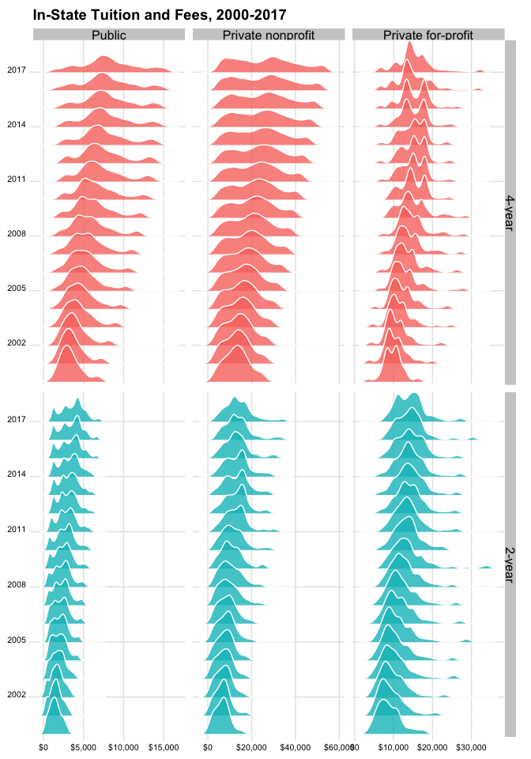

<!-- README.md is generated from README.Rmd. Please edit that file -->
About `scorecard`
=================

[](https://travis-ci.org/jjchern/scorecard) [](https://ci.appveyor.com/project/jjchern/scorecard)

The `scorecard` repo contains an R script `prep.R` (in the [`data-raw` folder](https://github.com/jjchern/scorecard/tree/master/data-raw)) that downloads and process raw data from the [College Scorecard](https://collegescorecard.ed.gov), 1996-2014. The datasets are stored in the [`data` folder](https://github.com/jjchern/scorecard/tree/master/data).

The scorecard dataset is an imbalance panel at the colleges-by-school-year level. The data was last updated on January 13th, 2017 (as of August 5, 2017). See the [changelog](https://collegescorecard.ed.gov/data/changelog/) for more details.

The following datasets are available:

-   `scorecard::mf1996_97`
-   `scorecard::mf1997_98`
-   `scorecard::mf1998_99`
-   `scorecard::mf1999_00`
-   `scorecard::mf2000_01`
-   `scorecard::mf2001_02`
-   `scorecard::mf2002_03`
-   `scorecard::mf2003_04`
-   `scorecard::mf2004_05`
-   `scorecard::mf2005_06`
-   `scorecard::mf2006_07`
-   `scorecard::mf2007_08`
-   `scorecard::mf2008_09`
-   `scorecard::mf2009_10`
-   `scorecard::mf2010_11`
-   `scorecard::mf2011_12`
-   `scorecard::mf2012_13`
-   `scorecard::mf2013_14`
-   `scorecard::mf2014_15`
-   `scorecard::codebook`
-   `scorecard::cohort_map`

The following functions are implemented:

-   `scorecard::attach_var_label()`: Assign variable labels.
-   `scorecard::attach_val_label()`: Assign value labels for certain variables

Related R Package
=================

[Benjamin Skinner](https://github.com/btskinner) has created a wonderful R client [`rscorecard`](http://btskinner.me/rscorecard/) for the [College Scorecard GET API](https://collegescorecard.ed.gov/data/documentation/). If you're interested in getting some specific variables quickly, I suggest using the `rscorecard` package.

Installation
============

You can also download the datasets as an R package. The size of the `data` folder is 138.1 MB, so it might take a while to install and load into memory.

``` r
# install.packages("devtools")
devtools::install_github("jjchern/scorecard")

# To uninstall the package, use:
# remove.packages("scorecard")
```

Examples
========

Loading the merged file for school year 2014-15
-----------------------------------------------

All datasets are tibbles:

``` r
library(tidyverse)
scorecard::mf2014_15
#> # A tibble: 7,703 x 1,744
#>    mf_year unitid    opeid opeid6                              instnm
#>      <chr>  <dbl>    <chr>  <chr>                               <chr>
#>  1 2014-15 100654 00100200 001002            Alabama A & M University
#>  2 2014-15 100663 00105200 001052 University of Alabama at Birmingham
#>  3 2014-15 100690 02503400 025034                  Amridge University
#>  4 2014-15 100706 00105500 001055 University of Alabama in Huntsville
#>  5 2014-15 100724 00100500 001005            Alabama State University
#>  6 2014-15 100751 00105100 001051           The University of Alabama
#>  7 2014-15 100760 00100700 001007   Central Alabama Community College
#>  8 2014-15 100812 00100800 001008             Athens State University
#>  9 2014-15 100830 00831000 008310     Auburn University at Montgomery
#> 10 2014-15 100858 00100900 001009                   Auburn University
#> # ... with 7,693 more rows, and 1739 more variables: city <chr>,
#> #   stabbr <chr>, zip <chr>, accredagency <chr>, insturl <chr>,
#> #   npcurl <chr>, sch_deg <chr>, hcm2 <dbl>, main <dbl+lbl>,
#> #   numbranch <dbl>, preddeg <dbl+lbl>, highdeg <dbl+lbl>,
#> #   control <dbl+lbl>, st_fips <dbl+lbl>, region <dbl+lbl>,
#> #   locale <dbl+lbl>, locale2 <dbl+lbl>, latitude <dbl>, longitude <dbl>,
#> #   ccbasic <dbl+lbl>, ccugprof <dbl+lbl>, ccsizset <dbl+lbl>,
#> #   hbcu <dbl+lbl>, pbi <dbl+lbl>, annhi <dbl+lbl>, tribal <dbl+lbl>,
#> #   aanapii <dbl+lbl>, hsi <dbl+lbl>, nanti <dbl+lbl>, menonly <dbl+lbl>,
#> #   womenonly <dbl+lbl>, relaffil <dbl+lbl>, adm_rate <dbl>,
#> #   adm_rate_all <dbl>, satvr25 <dbl>, satvr75 <dbl>, satmt25 <dbl>,
#> #   satmt75 <dbl>, satwr25 <dbl>, satwr75 <dbl>, satvrmid <dbl>,
#> #   satmtmid <dbl>, satwrmid <dbl>, actcm25 <dbl>, actcm75 <dbl>,
#> #   acten25 <dbl>, acten75 <dbl>, actmt25 <dbl>, actmt75 <dbl>,
#> #   actwr25 <dbl>, actwr75 <dbl>, actcmmid <dbl>, actenmid <dbl>,
#> #   actmtmid <dbl>, actwrmid <dbl>, sat_avg <dbl>, sat_avg_all <dbl>,
#> #   pcip01 <dbl>, pcip03 <dbl>, pcip04 <dbl>, pcip05 <dbl>, pcip09 <dbl>,
#> #   pcip10 <dbl>, pcip11 <dbl>, pcip12 <dbl>, pcip13 <dbl>, pcip14 <dbl>,
#> #   pcip15 <dbl>, pcip16 <dbl>, pcip19 <dbl>, pcip22 <dbl>, pcip23 <dbl>,
#> #   pcip24 <dbl>, pcip25 <dbl>, pcip26 <dbl>, pcip27 <dbl>, pcip29 <dbl>,
#> #   pcip30 <dbl>, pcip31 <dbl>, pcip38 <dbl>, pcip39 <dbl>, pcip40 <dbl>,
#> #   pcip41 <dbl>, pcip42 <dbl>, pcip43 <dbl>, pcip44 <dbl>, pcip45 <dbl>,
#> #   pcip46 <dbl>, pcip47 <dbl>, pcip48 <dbl>, pcip49 <dbl>, pcip50 <dbl>,
#> #   pcip51 <dbl>, pcip52 <dbl>, pcip54 <dbl>, cip01cert1 <dbl+lbl>,
#> #   cip01cert2 <dbl+lbl>, cip01assoc <dbl+lbl>, cip01cert4 <dbl>,
#> #   cip01bachl <dbl>, ...
```

Working with variable and value labels
--------------------------------------

All the datasets have variable labels attached, which can be viewed in RStudio's Data Viewer:

``` r
View(scorecard::mf2014_15)
```


You can also use the `labelled` package:

``` r
scorecard::mf2014_15 %>% 
  select(1:8) %>% 
  labelled::var_label()
#> $mf_year
#> NULL
#> 
#> $unitid
#> [1] "Unit ID for institution"
#> 
#> $opeid
#> [1] "8-digit OPE ID for institution"
#> 
#> $opeid6
#> [1] "6-digit OPE ID for institution"
#> 
#> $instnm
#> [1] "Institution name"
#> 
#> $city
#> [1] "City"
#> 
#> $stabbr
#> [1] "State postcode"
#> 
#> $zip
#> [1] "ZIP code"
```

Or work with the codebook directly:

``` r
## Show variable labels
scorecard::codebook %>% 
  select(var_name, var_label)
#> # A tibble: 1,975 x 2
#>        var_name                                  var_label
#>           <chr>                                      <chr>
#>  1       unitid                    Unit ID for institution
#>  2        opeid             8-digit OPE ID for institution
#>  3       opeid6             6-digit OPE ID for institution
#>  4       instnm                           Institution name
#>  5         city                                       City
#>  6       stabbr                             State postcode
#>  7          zip                                   ZIP code
#>  8 accredagency                 Accreditor for institution
#>  9      insturl             URL for institution's homepage
#> 10       npcurl URL for institution's net price calculator
#> # ... with 1,965 more rows

## Build a small function to shown value labels
show_val_label = . %>% {
    filter(scorecard::codebook, var_name == .) %>% 
    mutate(val_label = glue::glue("{val_label}  = {value}")) %>% 
    distinct(val_label)}

## Show value labels:
show_val_label("curroper")
#> # A tibble: 2 x 1
#>                                                  val_label
#>                                                      <chr>
#> 1 Not currently certified as an operating institution  = 0
#> 2                    Currently certified as operating  = 1
show_val_label("distanceonly")
#> # A tibble: 2 x 1
#>                          val_label
#>                              <chr>
#> 1 Not distance-education only  = 0
#> 2     Distance-education only  = 1
```

In binding multiple years of data with `dyplr::bind_rows()`, however, labels will get dropped. To throw back the labels, `scorecard` also provides to simple functions that attach variable and value labels to the tibbles:

``` r
bind_rows(
  scorecard::mf2014_15 %>% select(mf_year, instnm, control, adm_rate),
  scorecard::mf2013_14 %>% select(mf_year, instnm, control, adm_rate)
) %>% 
  scorecard::attach_var_label() %>% 
  scorecard::attach_val_label() -> df

df
#> # A tibble: 15,507 x 4
#>    mf_year                              instnm   control adm_rate
#>      <chr>                               <chr> <dbl+lbl>    <dbl>
#>  1 2014-15            Alabama A & M University         1   0.5256
#>  2 2014-15 University of Alabama at Birmingham         1   0.8569
#>  3 2014-15                  Amridge University         2       NA
#>  4 2014-15 University of Alabama in Huntsville         1   0.8203
#>  5 2014-15            Alabama State University         1   0.5326
#>  6 2014-15           The University of Alabama         1   0.5105
#>  7 2014-15   Central Alabama Community College         1       NA
#>  8 2014-15             Athens State University         1       NA
#>  9 2014-15     Auburn University at Montgomery         1   0.8017
#> 10 2014-15                   Auburn University         1   0.8347
#> # ... with 15,497 more rows
labelled::var_label(df)
#> $mf_year
#> NULL
#> 
#> $instnm
#> [1] "Institution name"
#> 
#> $control
#> [1] "Control of institution"
#> 
#> $adm_rate
#> [1] "Admission rate"
labelled::val_labels(df)
#> $mf_year
#> NULL
#> 
#> $instnm
#> NULL
#> 
#> $control
#>             Public  Private nonprofit Private for-profit 
#>                  1                  2                  3 
#> 
#> $adm_rate
#> NULL
```

Exploring codebook and plot in-state tuition with a joyplot
-----------------------------------------------------------

``` r
vars = c("mf_year", "iclevel", "control", "tuitionfee_in")

scorecard::codebook %>% 
  select(var_name, var_label, value, val_label) %>% 
  filter(var_name %in% vars) %>% 
  knitr::kable()
```

| var\_name      | var\_label                |  value| val\_label         |
|:---------------|:--------------------------|------:|:-------------------|
| control        | Control of institution    |      1| Public             |
| control        | Control of institution    |      2| Private nonprofit  |
| control        | Control of institution    |      3| Private for-profit |
| tuitionfee\_in | In-state tuition and fees |     NA| NA                 |
| iclevel        | Level of institution      |      1| 4-year             |
| iclevel        | Level of institution      |      2| 2-year             |
| iclevel        | Level of institution      |      3| Less-than-2-year   |

``` r

dplyr_seq = . %>% 
  select(one_of(vars)) %>%
  haven::as_factor() %>% 
  filter(iclevel %in% c("4-year", "2-year")) %>% 
  mutate(year = mf_year %>% parse_number() %>% as.factor()) %>% 
  group_by(iclevel, control) %>% 
  mutate_at(c("tuitionfee_in"),
            ~statar::winsorise(., probs = c(0.02, 0.98), verbose = FALSE)) %>% 
  ungroup()

## Test the functional sequence
scorecard::mf2014_15 %>% dplyr_seq()
#> # A tibble: 5,530 x 5
#>    mf_year iclevel           control tuitionfee_in   year
#>      <chr>  <fctr>            <fctr>         <dbl> <fctr>
#>  1 2014-15  4-year            Public          9096   2014
#>  2 2014-15  4-year            Public          7510   2014
#>  3 2014-15  4-year Private nonprofit          6900   2014
#>  4 2014-15  4-year            Public          9158   2014
#>  5 2014-15  4-year            Public          8720   2014
#>  6 2014-15  4-year            Public          9826   2014
#>  7 2014-15  2-year            Public          3491   2014
#>  8 2014-15  4-year            Public            NA   2014
#>  9 2014-15  4-year            Public          9080   2014
#> 10 2014-15  4-year            Public         10200   2014
#> # ... with 5,520 more rows

bind_rows(
  scorecard::mf2014_15 %>% dplyr_seq(),
  scorecard::mf2013_14 %>% dplyr_seq(),
  scorecard::mf2012_13 %>% dplyr_seq(),
  scorecard::mf2011_12 %>% dplyr_seq(),
  scorecard::mf2010_11 %>% dplyr_seq(),
  scorecard::mf2009_10 %>% dplyr_seq(),
  scorecard::mf2008_09 %>% dplyr_seq(),
  scorecard::mf2007_08 %>% dplyr_seq(),
  scorecard::mf2006_07 %>% dplyr_seq(),
  scorecard::mf2005_06 %>% dplyr_seq(),
  scorecard::mf2004_05 %>% dplyr_seq(),
  scorecard::mf2003_04 %>% dplyr_seq(),
  scorecard::mf2002_03 %>% dplyr_seq(),
  scorecard::mf2001_02 %>% dplyr_seq(),
  scorecard::mf2000_01 %>% dplyr_seq()
) -> df

df %>% 
  ggplot(aes(x = tuitionfee_in, y = year, fill = iclevel)) +
  ggjoy::geom_joy(scale = 2, alpha = .8, colour = "white") +
  ggjoy::theme_joy() +
  facet_grid(iclevel~control, scales = "free") +
  labs(x = NULL, y = NULL,
       title = "In-State Tuition and Fees, 2000-2014") +
  scale_x_continuous(labels = scales::dollar) +
  scale_y_discrete(breaks = seq(2014, 2000, -3), 
                   expand = c(0.01, 0)) +
  theme(axis.text = element_text(size = 8),
        legend.position = "none")
```



Compareing in-state and out-of-state tuition and fees
-----------------------------------------------------

``` r
vars = c("mf_year", "iclevel", "control", "tuitionfee_in", "tuitionfee_out")

dplyr_seq = . %>% 
  select(one_of(vars)) %>%
  haven::as_factor() %>% 
  filter(iclevel %in% c("4-year", "2-year")) %>% 
  filter(control == "Public") %>% 
  mutate(type = paste(control, iclevel)) %>% 
  mutate(year = mf_year %>% parse_number() %>% as.factor()) %>% 
  group_by(type) %>% 
  mutate_at(c("tuitionfee_in", "tuitionfee_out"),
            ~statar::winsorise(., probs = c(0.02, 0.98), verbose = FALSE)) %>% 
  ungroup() %>% 
  gather(in_or_out, tuitionfee, tuitionfee_in:tuitionfee_out) %>% 
  mutate(in_or_out = if_else(in_or_out == "tuitionfee_in",
                              "In-state tuition and fees",
                              "Out-of-state tuition and fees"))

## Test the functional sequence
scorecard::mf2014_15 %>% dplyr_seq()
#> # A tibble: 3,600 x 7
#>    mf_year iclevel control          type   year                 in_or_out
#>      <chr>  <fctr>  <fctr>         <chr> <fctr>                     <chr>
#>  1 2014-15  4-year  Public Public 4-year   2014 In-state tuition and fees
#>  2 2014-15  4-year  Public Public 4-year   2014 In-state tuition and fees
#>  3 2014-15  4-year  Public Public 4-year   2014 In-state tuition and fees
#>  4 2014-15  4-year  Public Public 4-year   2014 In-state tuition and fees
#>  5 2014-15  4-year  Public Public 4-year   2014 In-state tuition and fees
#>  6 2014-15  2-year  Public Public 2-year   2014 In-state tuition and fees
#>  7 2014-15  4-year  Public Public 4-year   2014 In-state tuition and fees
#>  8 2014-15  4-year  Public Public 4-year   2014 In-state tuition and fees
#>  9 2014-15  4-year  Public Public 4-year   2014 In-state tuition and fees
#> 10 2014-15  2-year  Public Public 2-year   2014 In-state tuition and fees
#> # ... with 3,590 more rows, and 1 more variables: tuitionfee <dbl>

bind_rows(
  scorecard::mf2014_15 %>% dplyr_seq(),
  scorecard::mf2013_14 %>% dplyr_seq(),
  scorecard::mf2012_13 %>% dplyr_seq(),
  scorecard::mf2011_12 %>% dplyr_seq(),
  scorecard::mf2010_11 %>% dplyr_seq(),
  scorecard::mf2009_10 %>% dplyr_seq(),
  scorecard::mf2008_09 %>% dplyr_seq(),
  scorecard::mf2007_08 %>% dplyr_seq(),
  scorecard::mf2006_07 %>% dplyr_seq(),
  scorecard::mf2005_06 %>% dplyr_seq(),
  scorecard::mf2004_05 %>% dplyr_seq(),
  scorecard::mf2003_04 %>% dplyr_seq(),
  scorecard::mf2002_03 %>% dplyr_seq(),
  scorecard::mf2001_02 %>% dplyr_seq(),
  scorecard::mf2000_01 %>% dplyr_seq()
) -> df

df %>% 
  ggplot(aes(x = tuitionfee, y = year, fill = in_or_out)) +
  ggjoy::geom_joy(scale = 2, alpha = .8, colour = "white") +
  ggjoy::theme_joy() +
  facet_wrap(~type, scales = "free") +
  labs(x = NULL, y = NULL,
       title = "In-State Vs. Out-of-State Tuition and Fees for Public Colleges",
       caption = "Source: College Scorecard, 2000-2014") +
  scale_x_continuous(labels = scales::dollar) +
  scale_y_discrete(breaks = seq(2014, 2000, -3), 
                   expand = c(0.01, 0)) +
  theme(axis.text = element_text(size = 9),
        legend.position = "top",
        legend.title = element_blank(),
        legend.justification = "center")
```


